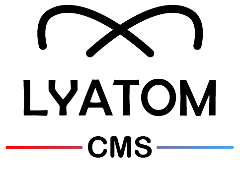

  

<h1 align="center">Lyatom CMS <small>(React.js Package)</small></h1>

## About

Lyatom CMS est un Package concu en React.js qui permet aux utilisateurs par un moyen simple de modifier et d'ajouter du contenu directement sur votre site concu en React.js

## Core characteristics

- Inscription + Connection
- Modifiez votre site en temps réel
- Edition Cross-Platform
- Authentification **external OAuth** (compte : Google, Netlify Identity, Github )
- Gestion des Utilisateurs
- Versionning

## Get started

- Ajouter le package à votre projet
- Créer une clé personnel Github
- Créer son fichier de Configuration
- Initiliaser l'adminPanel sur la page souhaité

## Documentation

- un lien
-

## Features

- Enrichir les types Inputs
- Support de plusieurs langue
- Gestion de rôle ( edition, lecture )
- Outil permettant la création automatique du fichier de configuration

## Not for everyone ✌️

Prérequis necéssaires :

- le site doit-etre concu en [React.js](https://fr.reactjs.org/).
- Le site doit utiliser [Netlify](https://www.netlify.com/)

## Motivation

Nous avons créer ce CMS pour proposer une expérience légère & fluide à l'utilisateur avec un design épuré afin de s'adapter à tous type d'utilisation.

Avec des fonctionnalités d'un Content Manager System LyatomCMS à l'avantage de fonctionner sans serveur (Git-based CMS)

## Open Source

Nous avons développé & proposons l'utilisation de ce cms gratuitement afin d'en faire un outil collaboratif et évolutif.

## Need help

> Pas le temps de s'y pencher, des difficultés d'intégrations ? NJG Connect vous accompagne sur la mise en place de l'outil sur votre site web.

## Contributing

N'hesitez pas à proposer des améliorations, remonter des bugs pour faire de cette outil, NOTRE OUTIL.

## Creator ✍️

Propulsé par [NJG Connect](https://njgconnect.fr/) Entreprise digital spécialisé dans le Développement, graphisme et conseil digital.

- Designé par [Jonathan Nohile](https://www.linkedin.com/in/jonathan-nohile) (CEO - NJG Connect)
- Développé par [Jeremy Noh](https://github.com/JeremyNoh) (CTO - NJG Connect)

## Read this in other languages

- English
- French
